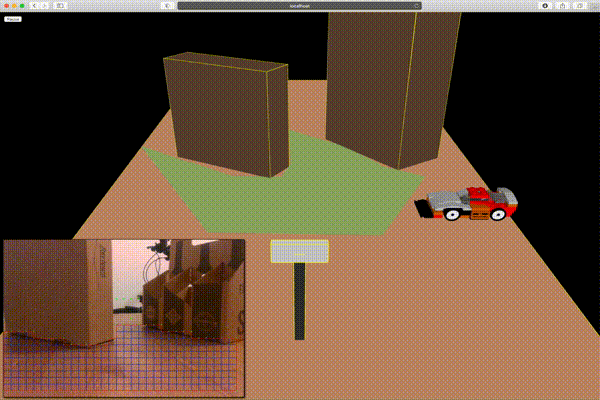

# Visible Polygon Visualizer

## Application overview

React based 3D visualization app made using `regl-worldview`. Learn more about world view [here](https://webviz.io/worldview/#/).

The app is visualizing and animating the data generated by `visible-polygon-extractor` 
[GitHub Link](https://github.com/sidthakur/visible-polygon-extractor).

RGB Camera view (with annotations to explain the outcome of the algorithm), and the visible ground polygon
(draw in green) are outputs generated by the `visible-polygon-extractor` using raw sensor data. 
All other elements visualized in the 3D world (table, cardboard boxes, sensor and Lego car) have been
modeled and placed in the 3D scene. The Lego car is a free to use model from Sketch Fab. The Lego car
model in the 3D scene is slightly different from the lego car used with the sensor in the image.
The Lego car has been animated to move at a fixed speed along a fixed trajectory.

This project was bootstrapped with [Create React App](https://github.com/facebook/create-react-app).

## Available Scripts

In the project directory, you can run:

### `npm start`

Runs the app in the development mode.\
Open [http://localhost:3000](http://localhost:3000) to view it in the browser.

The page will reload if you make edits.\
You will also see any lint errors in the console.